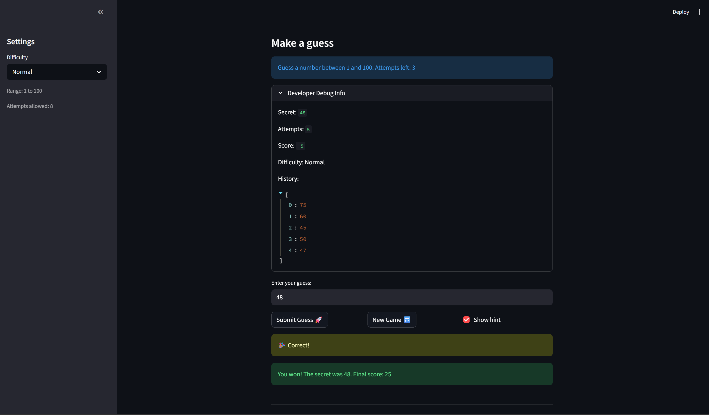

# 🎮 Game Glitch Investigator: The Impossible Guesser

## 🚨 The Situation

You asked an AI to build a simple "Number Guessing Game" using Streamlit.
It wrote the code, ran away, and now the game is unplayable. 

- You can't win.
- The hints lie to you.
- The secret number seems to have commitment issues.

## 🛠️ Setup

1. Install dependencies: `pip install -r requirements.txt`
2. Run the broken app: `python -m streamlit run app.py`

## 🕵️‍♂️ Your Mission

1. **Play the game.** Open the "Developer Debug Info" tab in the app to see the secret number. Try to win.
2. **Find the State Bug.** Why does the secret number change every time you click "Submit"? Ask ChatGPT: *"How do I keep a variable from resetting in Streamlit when I click a button?"*
3. **Fix the Logic.** The hints ("Higher/Lower") are wrong. Fix them.
4. **Refactor & Test.** - Move the logic into `logic_utils.py`.
   - Run `pytest` in your terminal.
   - Keep fixing until all tests pass!

## 📝 Document Your Experience

- [ ] Describe the game's purpose.

   A number guessing game where you try to guess a secret number within a limited number of attempts. Each guess gives you a hint to go higher or lower.
- [ ] Detail which bugs you found.

   Hints were backwards — "Go Higher" and "Go Lower" messages were swapped

   On even attempts, the secret was converted to a string causing incorrect comparisons (e.g. 99 < "4" lexicographically)

   Attempts initialized at 1 instead of 0, giving one fewer attempt than intended

   Hard difficulty had a range of 1-50, which is actually easier than Normal (1-100)
- [ ] Explain what fixes you applied.

   Swapped the "Go Higher" and "Go Lower" messages in check_guess

   Removed the string conversion so the secret is always compared as an integer

   Changed attempts initialization from 1 to 0
   
   Widened Hard difficulty range from 1-50 to 1-200

## 📸 Demo

- [ ] 

## 🚀 Stretch Features

- [ ] [If you choose to complete Challenge 4, insert a screenshot of your Enhanced Game UI here]
